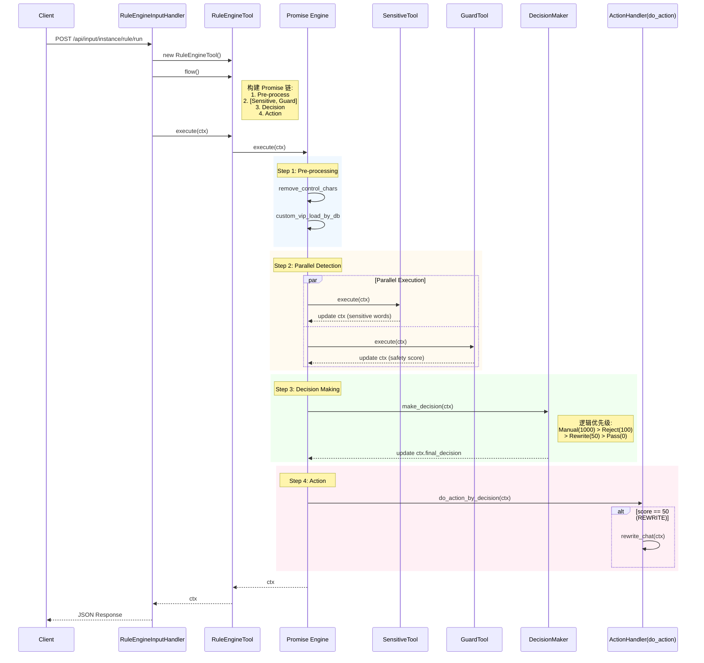

# Code Review: Rule Engine Execution Flow

## 1. 功能逻辑理解 (Functional Understanding)

该功能是一个基于规则引擎的敏感内容检测与处理服务，入口点为 `/api/input/instance/rule/run`。其主要目的是接收用户输入 (Prompt)，并通过一系列并行的检测手段（敏感词库、大模型Guard），最终结合配置的规则（VIP白/黑名单、自定义规则、全局规则）做出决策（通过、拒绝、改写或人工审核）。

**核心流程如下：**

1.  **接收请求**: `RuleEngineInputHandler` 接收 POST 请求，校验入参 `SensitiveContext`。
2.  **初始化工具**: 实例化 `RuleEngineTool`，并构建执行流 (`flow`)。
3.  **构建 Promise 链 (Promise Chain)**:
    *   **预处理**: 清除控制字符 (`remove_control_chars`)，加载自定义配置 (`custom_vip_load_by_db`)。
    *   **并行检测**: 同时执行 `SensitiveTool` (敏感词自动机) 和 `GuardTool` (模型检测)。
    *   **决策判定**: 执行 `make_decision`，聚合上述检测结果，根据优先级计算最终分值。
    *   **执行动作**: 执行 `do_action_by_decision`，根据决策结果触发特定行为（如：如果决策为 `REWRITE` (50分)，则调用大模型进行意图改写）。
4.  **返回结果**: 返回最终决策 (`final_decision`) 和所有决策细节。

## 2. 时序图 (Sequence Diagram)



## 3. Code Review & Optimization Suggestions

### A. 逻辑正确性 (Logic correctness)

1.  **决策优先级设计合理**:
    *   代码中使用了 `DecisionClassifyEnum` (Pass=0, Reject=100, Rewrite=50, Manual=1000)。
    *   在 `rank_by_normal_rules` 和 `decision_jugde` 中使用了 `if decision.value > final_decision`。这确保了更严重的判决（如 Reject 或 Manual）会覆盖较轻的判决（如 Pass），符合安全风控原则。
2.  **并行执行**:
    *   `Promise` 类通过 `asyncio.gather` 实现了 `SensitiveTool` 和 `GuardTool` 的并行执行，这对于降低接口延迟非常关键。

### B. 潜在风险与逻辑漏洞 (Potential Risks)

1.  **异常处理过于激进**:
    *   在 `tools/rule_engine_tools/decision_maker.py` 的 `rank_by_normal_rules` 函数中：
        ```python
        if not data_provider.global_rules.get(_label):
            logger.error(f"KEY_NOT_IN_RULE_ERROR -- {_label}")
            raise Exception("KEY_NOT_IN_RULE_ERROR")
        ```
    *   **风险**: 如果配置数据 (`global_rules`) 和代码逻辑不一致（例如某个分类的模型返回了新标签，但规则库未更新），整个接口会直接抛出 500 错误。
    *   **建议**: 建议提供一个默认的 Fallback 策略（例如默认 BLOCK 或 default decision），而不是直接 crash 服务。

2.  **上下文对象的可变性 (Mutable Context)**:
    *   `SensitiveContext` 在整个 Promise 链中被传递和修改。虽然这是 Pipeline 模式的常见做法，但 `ctx.final_decision`, `ctx.all_decision_dict` 等字段在不同函数中被隐式修改，使得追踪数据流变得困难。
    *   **建议**: 尽量让函数返回新的数据结构，而不是直接修改 `ctx`，或者明确 `ctx` 的修改范围。

3.  **硬编码依赖**:
    *   在 `do_action_by_decision` -> `rewrite_chat` 中：
        ```python
        intent_instance: IntentService = IntentService()
        ```
    *   **优化**: 这里在函数内部直接实例化了 `IntentService`。建议使用依赖注入或单例模式，便于单元测试 mock 该服务。

### C. 优化建议 (Optimization Points)

1.  **代码复用**:
    *   `decision_jugde` 函数定义在 `make_decision` 内部。如果这个逻辑通用，可以提取出来作为独立的辅助函数，增加可读性。

2.  **类型安全**:
    *   `rank_by_words` 接收 `action: DecisionClassifyEnum`，但在调用时硬编码了 `DecisionClassifyEnum.REJECT`。虽然没错，但建议在 `models` 中明确定义这些映射关系。

3.  **配置加载**:
    *   `load_rule` 函数使用了同步的文件 IO (`open(__path, "r")`)。虽然是在 `run_in_async` 中被调用（通过 Promise 包装），但最好确认文件读取频率。如果频繁读取，建议增加内存缓存 (LRU Cache)。(目前看代码里似乎有 `loaded` 标志位做缓存，这是好的)。

4.  **性能监控**:
    *   `@async_perf_count` 装饰器很好。建议保留并确保日志级别在生产环境可控。
